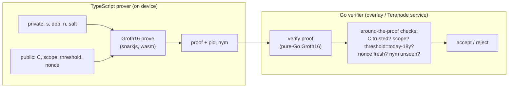

# BSV Unified Identity — Zero-Knowledge Proofs: Design & Proof-of-Concept

**Status:** v0.2 · **Scope:** the *presentation-time* proof (predicate + unlinkable pseudonym), with credential enrolment mocked. **Snapshot:** current as of June 2026 — library names, versions, draft numbers, and certification status all move; re-check before relying on them.
**Changes since v0.1:** added threat-model/properties table, performance estimates + measured KAT vectors, an end-to-end test script, a BSV anchoring note, and a quantum-readiness roadmap; strengthened the nonce-binding, range-check, and trusted-setup sections; corrected the permissive-stack guidance (Noir and gnark are not a turnkey prover/verifier pair — see §3, §7).

This is a companion to the standards proposal (referenced below as *Spec §N*) and its technical white paper. It exists because the zero-knowledge layer is the least familiar and highest-risk part of the design, and "Layers A–D" in Spec §13 is too abstract to build against. Here we (1) write down exactly what the presentation proof must prove, (2) give a buildable proof-of-concept with a TypeScript on-device prover and a Go server-side verifier, (3) name the concrete libraries in both languages, (4) tell the truth about what "certified" can and cannot mean today, and (5) give measured test vectors so the two language stacks can be trusted to agree.

---

## 1. What we are proving, and what we are not

Spec §13 defines four capability layers: **(A)** selective disclosure, **(B)** attribute predicates, **(C)** multi-show unlinkable presentation, **(D)** a single succinct proof of the whole statement including — for the free Tier-1 self-read — verifying the passport's ICAO 9303 passive-authentication signature chain *in-circuit*.

Layer D at enrolment is the heavy, unfamiliar part (millions of constraints to verify an RSA/ECDSA document-signer signature inside a circuit). The design deliberately **amortizes** it: prove the passport once at enrolment, bind it to a published commitment, and thereafter every presentation is a cheap proof over that commitment. This PoC builds the cheap, everyday half — the **presentation proof** — and *mocks* enrolment by standing in a plain commitment where the issuer/passport proof would go. That isolates the predicate-plus-pseudonym mechanics (Layers A/B plus the pseudonym derivation) so they can be proven out end-to-end, in the exact TS-prover / Go-verifier split a BSV deployment would use, without first solving the passport circuit.

**In scope:** prove, in zero knowledge, that the holder (a) holds a credential committing to their secret and attributes, (b) satisfies a predicate (age ≥ 18) without revealing the underlying attribute, (c) derives a pseudonym stable for one relying party and unlinkable across relying parties, and (d) derives a scope-bound uniqueness nullifier — revealing only the pseudonym, the nullifier, and the truth of the predicate.

**Out of scope (mocked):** how the credential commitment came to be trusted — the issuer signature (Tier 2/3) or the in-circuit passport passive-authentication (Tier 1). §12 says exactly how to remove the mock.

---

## 2. The statement, precisely

Let `PRF` be a SNARK-friendly pseudo-random function (Poseidon over the proof field), with distinct domain-separation tags per use. The holder has a wallet-held **presentation secret** `s` (derived from the root secret, Spec §8.4), a **personhood nullifier** `n` (fixed at enrolment; one-way function of passport identity, *not secret*), and credential attributes (here, date of birth `dob`).

**Public inputs** (agreed by prover and verifier): `C` — the credential commitment (trusted because an issuer produced it; *mocked here*); `scope` — a canonical hash of the relying-party identity; `threshold` — the newest `dob` that is still ≥ 18 today, supplied by the verifier; `nonce` — the verifier's freshness challenge.

**Public outputs** (revealed): `pid` — the scoped pseudonym; `nym` — the scope-bound uniqueness nullifier.

**Private witness** (never revealed): `s`, `dob`, `n`, and the commitment blinding `salt`.

The circuit enforces:

- **R1 — credential opening:** `C = PRF(DS_COMMIT, s, dob, n, salt)`.
- **R2 — predicate:** `dob ≤ threshold` ⇔ age ≥ 18. Only the *truth* of this is revealed, never `dob`.
- **R3 — scoped pseudonym:** `pid = PRF(DS_PID, s, scope)`. Stable for a scope, one-way, uncorrelated across scopes, and *not* derivable from `n`.
- **R4 — uniqueness nullifier:** `nym = PRF(DS_NYM, n, scope)`. Lets a relying party enforce one-account-per-person within its scope without learning `n` or linking across scopes.
- **R5 — freshness:** the proof is bound to `nonce` (see §8.1 for how, and why the verifier still does the real work).

Why the `s` / `n` split matters here (Spec §8.4): `pid` is keyed only by `s`, so someone who has read the passport (and can recompute `n`) still cannot compute anyone's pseudonyms; `nym` is keyed by `n`, so uniqueness survives across wallets and re-installs. Collapsing the two would let anyone who handled the passport recompute the holder's pseudonyms — the failure this structure exists to prevent.



---

## 3. Choosing a proving system for the PoC

The binding constraint is **prove in TypeScript on the device, verify in Go on the server.** That rules out anything without a real prover in one language and a verifier in the other, over a matching curve and serialization.

**Track A — general-purpose SNARK (Circom + Groth16 on BN254). Used by this PoC.** Circom is the de-facto circuit language; snarkjs is a pure-JS/wasm prover that runs on-device; and there are pure-Go verifiers that accept snarkjs proofs verbatim (§7). Groth16 gives ~128–256-byte proofs and constant-time verification. Its cost is a per-circuit trusted setup (§8.3). This track proves the *genuine* ZK predicate (`dob → age≥18` inside the circuit) and the pseudonym derivation directly — exactly Spec §13 Layer B plus the pseudonym.

**Track B — anonymous credentials (BBS + per-verifier pseudonyms).** BBS signatures give selective disclosure with multi-show unlinkable presentations; the CFRG "BBS per-verifier linkability" draft adds a pseudonym constant for one prover↔verifier pair and unlinkable across verifiers — i.e. `pid` as a native primitive. This is the ETSI/ARF-catalogued direction (Spec §19.4). Limitation: predicates like age ≥ 18 are not native — the standards-track workaround is an issuer-provided `age_over_18` boolean claim, selectively disclosed (the ISO mDL / EUDI approach), rather than a range proof. Both BBS and its pseudonym mechanism are IRTF *drafts*; implementations are early and cross-vendor interop needs care.

> **Decision log — why Groth16/Circom for the PoC.**
> - *Smallest proofs, constant-time verify.* Groth16 proofs are 3 group elements (~128–256 B) and verify in constant time regardless of circuit size — ideal for a server verifying many presentations and for bandwidth-limited wallets.
> - *Only turnkey TS-prove → Go-verify path today.* snarkjs proves in wasm on-device; iden3's pure-Go verifier consumes those proofs unchanged (§7). No other stack gives that split out of the box right now.
> - *Genuine predicate ZK.* Track A proves `age≥18` from `dob` in-circuit, demonstrating Layer B rather than sidestepping it with a pre-issued boolean.
> - *Accepted cost:* a per-circuit trusted setup (§8.3) and BN254 (not post-quantum, §12.1). Both are addressed on the production roadmap by moving to a universal-setup (PLONK) or transparent (Halo2/STARK) system.
> - *Not chosen for shipping:* Circom/snarkjs are GPL-3.0. For a shipped wallet, prefer a permissive stack (§7).

**Shipped-wallet recommendation (read §7 before choosing).** For anything distributed in a wallet binary, prioritize **permissive-licensed** tooling — Noir (MIT/Apache-2.0) on the prover side, and/or gnark (Apache-2.0). Note the correction from v0.1: **Noir and gnark are not a drop-in prover/verifier pair.** Noir's mainstream backend is Barretenberg (verified by `bb`, not by gnark); a community backend (`lambdaclass/noir_backend_using_gnark`) bridges Noir's ACIR to gnark (PLONK working, Groth16 WIP) but is experimental. So the permissive path is real but less turnkey than the GPL Circom/snarkjs → pure-Go-iden3 path used here. Build the PoC on Track A for interop; plan the shipped wallet on Noir (permissive), tracking the Noir→Go verification tooling.

---

## 4. The "certified" question — the honest answer

The requested bar was **formally certified (FIPS / Common Criteria / eIDAS)**. State it plainly: **no zero-knowledge proving library is FIPS-140-validated, Common Criteria-certified, or on any eIDAS trusted list — for any scheme, in any language.** FIPS validation covers cryptographic *primitives and modules* — SHA-2/SHA-3, ECDSA, RSA, AES, HMAC, the DRBG, and now the post-quantum signatures ML-DSA and SLH-DSA (FIPS 204/205) and ML-KEM (FIPS 203). It does not cover Groth16, PLONK, Halo2, STARKs, Bulletproofs, BBS+, or Poseidon. Common Criteria certifies *products* against protection profiles (secure elements, the EUDI wallet's secure cryptographic device); the ZK proving code is not that boundary. ETSI TR 119 476 — the reference the ARF points to — is a *survey* of selective-disclosure and ZK schemes, not a certification.

So "use a certified ZK library" is, in 2026, unsatisfiable as literally stated. The defensible architecture that gets as close as the state of the art allows:

1. **Keep the certified crypto inside the certified boundary.** Key generation, ECDSA/EdDSA signing, hashing, and randomness happen in the FIPS/CC-certified secure element (the wallet's WSCD). This is also the direct answer to the documented EU concern that early wallet pilots failed for not protecting key material in certified hardware (Spec §18.5).
2. **Treat the ZK proof as an application-layer computation *about* those certified operations, outside the certified boundary.** The circuit proves statements over commitments to values the certified module produced or signed. A proof is *publicly verifiable*: its soundness rests on the proving system and the circuit, not on trusting the prover's library or device. An attacker who replaces the prover cannot forge an accepted proof of a false statement — so the prover library need not be certified for the *verifier's* guarantee to hold.
3. **Harden the part certification would otherwise cover — circuit soundness — with audit and formal verification.** The dominant real-world ZK failure is the *under-constrained circuit*. Use static analyzers built for exactly this: `circomspect`, and the formal tools `Picus` and `Ecne`; for Noir, the `NAVe` line of ACIR formal verification. Pair with an independent audit. This is the practical substitute for "certified" until an eIDAS ZK certification regime exists — which the ARF's post-launch ZKP track is expected to move toward but has not delivered.
4. **Prefer primitives with a certification story where you have a choice.** Verification-side hashing and signature checks inside the certified module should use FIPS-validated implementations; where the roadmap needs post-quantum, ML-DSA (FIPS 204) is the certified target for the signing key, with the ZK layer proving over its outputs (§12.1).

Bottom line for the repo: this PoC uses **audited, widely-deployed** libraries and treats formal certification as a production-roadmap gap to be stated openly, not a checkbox that can be ticked today.

---

## 5. Security properties, threat model & revocation

**Threat model, in one paragraph.** The adversaries of concern are: colluding relying parties pooling what they store; a relying party colluding with the issuer; a passive network observer; a replay attacker; a thief of a device or credential; and — specific to this design — anyone who has read the holder's passport and can therefore recompute `n`. The presentation proof is built to hold against all of these *at the cryptographic layer*; it explicitly does **not** defeat network-level correlation (IP, timing, device fingerprint), which is a transport concern handled outside the proof (Spec §20.2), and it does not protect a device already compromised at proving time.

| Property | Mechanism | Holds against |
|---|---|---|
| Cross-scope unlinkability | `pid = PRF(s, scope)`, `s` wallet-only | colluding RPs pooling `pid`/`nym` |
| Attribute privacy | ZK; only the predicate's truth is revealed | the verifier; a network observer |
| Soundness / pseudonym unforgeability | Groth16 soundness + fully-constrained circuit | a malicious prover |
| Uniqueness (one account per scope) | `nym = PRF(n, scope)`; verifier tracks seen `nym` | Sybil behaviour within a scope |
| Passport-reader ≠ pseudonym-holder | `pid` keyed by `s` only, never by `n` | someone who recomputed `n` |
| Replay resistance | `nonce` binding + verifier single-use tracking | proof replay |
| Predicate integrity | verifier sets and checks `threshold` itself | a prover lying about age |
| **Not covered** | — | network correlation; pre-proving device compromise; within-scope linkability (by design) |

**Revocation sketch.** Three complementary mechanisms, deliberately layered because unlinkability constrains what is possible:

- *Credential-level (global) revocation* happens at the commitment/enrolment layer: the issuer maintains a status list or accumulator (Spec §11, §13.5), and the presentation proves in zero knowledge that `C` is **not** in the revoked set (privacy-preserving non-membership). Revoking `C` de-recognizes the credential everywhere at once, without linking the holder's scopes.
- *Per-scope (local) blocking* uses the nullifier: because `nym = PRF(n, scope)` is stable for a relying party, that party (or an overlay serving it) keeps a `nym` block-list and rejects any presentation whose `nym` is listed. This also gives one-time-use / rate-limiting via a spent-`nym` set.
- *The honest limit:* you **cannot** globally block a *person* across scopes by their `nym`s without linking those `nym`s — which unlinkability forbids by construction. Global de-recognition of a person is therefore done at the credential/enrolment anchor (revoke `C`, or revoke the enrolment record `n` was bound to), never by correlating scoped nullifiers. This is the same "de-recognition, not correlation" stance as the wider design.

On BSV specifically, both the status set and the `nym` lists are naturally overlay-indexed and anchored on-chain (§10).

---

## 6. Performance (estimated; KATs measured)

These are **order-of-magnitude estimates for the small presentation circuit** below (~1–1.5k R1CS constraints), not measurements on your hardware — run the benchmark in §9 on the target device. They are *not* the enrolment (Layer D passport) circuit, which is millions of constraints and takes seconds to tens of seconds, one time.

| Metric | Estimate | Notes |
|---|---|---|
| R1CS constraints | ~1,000–1,500 | 3× Poseidon + 2× Num2Bits(32) + LessEqThan(32) |
| Proof size (Groth16, BN254) | ~128–256 B | 2×G1 + 1×G2; JSON encoding is larger |
| Proving — snarkjs (wasm), laptop | ~50–200 ms | includes witness generation |
| Proving — snarkjs (wasm), phone | ~0.2–1 s | device-dependent |
| Proving — rapidsnark (native), phone | ~20–150 ms | rapidsnark is ~4–10× faster than snarkjs (§8.4) |
| Verification (Go, pairing-based) | **~1–3 ms** | 3 pairings + a small MSM; **not** sub-microsecond |
| Verify throughput | ~hundreds–1,000 /s/core | constant-time per proof |

A note on the "ns/µs" hope: Groth16 verification is *constant-time* but pairing-dominated, so it lands in **low single-digit milliseconds**, not nanoseconds. If you need sub-millisecond or batched verification, that is a reason to evaluate a different system (e.g. batched STARK verification), not a property Groth16-on-BN254 will give you.

**Measured cross-language anchor:** the Poseidon KAT vectors in §9 were computed in-container with `circomlibjs` and are reproduced by the Go side with `go-iden3-crypto/poseidon` (same canonical BN254 parameters). Those fixed vectors are what make the two stacks trustworthy against each other.

---

## 7. Libraries

Status labels: *audited* = has ≥1 public third-party security audit; *reference* = maintained but not independently audited; *draft-stage* = implements an IRTF/ETSI draft, expect churn. None are FIPS/CC/eIDAS certified (§4).

### TypeScript (on-device prover)

| Library | Role | Scheme / curve | License | Status |
|---|---|---|---|---|
| `circom` (compiler) | compile circuit → R1CS + wasm | R1CS | GPL-3.0 | de-facto standard |
| `snarkjs` | prove + verify (wasm) | Groth16 / PLONK / FFlonk, BN254 | GPL-3.0 | reference; very widely deployed |
| `circomlibjs` | witness-side Poseidon/EdDSA helpers | BN254 | GPL-3.0 | reference |
| `@mattrglobal/bbs-signatures` | BBS+ prove/verify (Track B) | BBS+, BLS12-381 | Apache-2.0 | audited; scheme is draft-stage |
| `@noir-lang/noir_js` + `bb.js` | prove (permissive alternative) | UltraHonk, BN254/grumpkin | MIT / Apache-2.0 | maturing; permissive |

### Go (server-side verifier)

| Library | Role | Scheme / curve | License | Status |
|---|---|---|---|---|
| `github.com/iden3/go-rapidsnark/verifier` | verify snarkjs proofs (pure Go) | Groth16, BN254 | Apache-2.0 / MIT | maintained; used in Polygon ID's auth stack |
| `github.com/iden3/go-circom-prover-verifier` | verify (and prove) Circom proofs, pure Go | Groth16, BN254 | GPL-3.0 | works; lighter maintenance |
| `github.com/consensys/gnark` | prove + verify (audited, heavyweight) | Groth16 / PLONK, BN254 & others | Apache-2.0 | audited; native format — bridge with `gnark-to-snarkjs` |
| `github.com/iden3/go-iden3-crypto/poseidon` | Poseidon (KAT reproduction, §9) | BN254 | Apache-2.0 / MIT | reference; matches circomlib params |
| `github.com/hyperledger/aries-framework-go` (bbs12381g2pub) | BBS+ verify (Track B) | BBS+, BLS12-381 | Apache-2.0 | draft-stage scheme; confirm current module path |

**Licensing — decisive for a shipped wallet.** Circom, snarkjs, circomlibjs, and iden3's `go-circom-prover-verifier` are **GPL-3.0**. Circuits and proofs you author are your own artifacts, but bundling GPL code into a distributed wallet binary pulls GPL obligations into that binary. If that is unwelcome — for a wallet it usually is — the permissive options are:
- **Prover:** Noir (`noir_js` + `bb.js`), MIT/Apache-2.0.
- **Verifier:** `go-rapidsnark/verifier` (Apache-2.0/MIT) for the Circom path, or `gnark` (Apache-2.0) for a gnark-native path.
- **Caveat (the v0.1 correction):** Noir's proofs are verified by Barretenberg, not by gnark, so "Noir prover + gnark verifier" is not a drop-in pair. Bridging them means the experimental `noir_backend_using_gnark` (ACIR→gnark) or wrapping `bb` from Go. A fully permissive, fully turnkey TS-prove/Go-verify path does not yet exist; the honest choice for a shipped wallet is Noir-permissive with a Barretenberg-based Go verification shim, tracked as the tooling matures.

---

## 8. Building the PoC

```
zk-poc/
  circuits/presentation.circom
  scripts/mock-enrolment.mjs        # fabricates the trusted commitment C
  prover-ts/prove.ts                # on-device prover (TypeScript)
  verifier-go/main.go               # server-side verifier (Go)
  test/e2e.sh                       # §9 end-to-end script
  test/kat.json                     # §9 known-answer vectors
```

### 8.1 The circuit

```circom
pragma circom 2.1.9;

include "poseidon.circom";     // circomlib
include "comparators.circom";  // circomlib: LessEqThan
include "bitify.circom";       // circomlib: Num2Bits (range checks)

// Presentation proof (enrolment mocked).
// Reveals only: pid, nym, and the truth of (age >= 18). Nothing else.
template Presentation() {
    // private witness
    signal input s;        // presentation secret (wallet-only, from root secret)
    signal input dob;      // date of birth, days since epoch
    signal input n;        // personhood nullifier (fixed at enrolment; not secret)
    signal input salt;     // commitment blinding

    // public inputs
    signal input C;         // credential commitment (trusted; MOCK issuer)
    signal input scope;     // canonical hash of the relying-party identity
    signal input threshold; // newest dob still >= 18 today (verifier-set)
    signal input nonce;     // verifier freshness challenge

    // public outputs
    signal output pid;      // scoped pseudonym
    signal output nym;      // scope-bound uniqueness nullifier

    var DS_COMMIT = 0;
    var DS_PID    = 1;
    var DS_NYM    = 2;

    // --- Range checks (see §11: this is a soundness requirement, not decoration) ---
    // LessEqThan(k) is only sound when BOTH inputs are known to be in [0, 2^k).
    // Field elements are ~254 bits; without these bounds a prover could choose a
    // `dob` that, reduced mod p, appears small and slips past the age check.
    // Num2Bits(32) forces dob and threshold into [0, 2^32) before comparison.
    component rDob = Num2Bits(32); rDob.in <== dob;
    component rThr = Num2Bits(32); rThr.in <== threshold;

    // R1: credential opening  C == Poseidon(DS_COMMIT, s, dob, n, salt)
    component commit = Poseidon(5);
    commit.inputs[0] <== DS_COMMIT;
    commit.inputs[1] <== s;
    commit.inputs[2] <== dob;
    commit.inputs[3] <== n;
    commit.inputs[4] <== salt;
    C === commit.out;

    // R2: predicate  age >= 18  <=>  dob <= threshold
    component le = LessEqThan(32);
    le.in[0] <== dob;
    le.in[1] <== threshold;
    le.out === 1;

    // R3: pid = Poseidon(DS_PID, s, scope)
    component pidH = Poseidon(3);
    pidH.inputs[0] <== DS_PID;
    pidH.inputs[1] <== s;
    pidH.inputs[2] <== scope;
    pid <== pidH.out;

    // R4: nym = Poseidon(DS_NYM, n, scope)
    component nymH = Poseidon(3);
    nymH.inputs[0] <== DS_NYM;
    nymH.inputs[1] <== n;
    nymH.inputs[2] <== scope;
    nym <== nymH.out;

    // R5: nonce binding (see §11). In Groth16 every PUBLIC input is already bound
    // to the proof by the verification equation, so a proof made for one `nonce`
    // fails verification if presented with another. The constraint below simply
    // forces the compiler to retain the signal in the R1CS; it is defensive, not
    // the source of freshness. The real anti-replay guarantee is the verifier
    // issuing a single-use, time-boxed nonce and rejecting reuse (§8.5, §11).
    signal nonceBound;
    nonceBound <== nonce * nonce;
}

component main {public [C, scope, threshold, nonce]} = Presentation();
```

### 8.2 Mock enrolment (stands in for the issuer / passport proof)

```js
// scripts/mock-enrolment.mjs   —  run:  node scripts/mock-enrolment.mjs > input.json
import { buildPoseidon } from "circomlibjs";

const poseidon = await buildPoseidon();
const F = poseidon.F;
const H = (arr) => F.toObject(poseidon(arr.map(BigInt)));

const DS_COMMIT = 0n;
const s    = 123456789n;   // wallet secret (demo)
const n    = 987654321n;   // personhood nullifier (demo)
const salt = 424242n;      // blinding
const dob  = 7305n;        // days since epoch, e.g. 1990-01-01

const DAY = 86400000;
const eighteenAgo = new Date(); eighteenAgo.setFullYear(eighteenAgo.getFullYear() - 18);
const threshold = BigInt(Math.floor(eighteenAgo.getTime() / DAY));

const C = H([DS_COMMIT, s, dob, n, salt]);
process.stdout.write(JSON.stringify({
  s: s+"", dob: dob+"", n: n+"", salt: salt+"",
  C: C+"", scope: "1122334455", threshold: threshold+"", nonce: "0"
}, null, 2));
// In production C is NOT a value the verifier merely trusts: it is issuer-signed
// (Tier 2/3) or the output of the in-circuit passport passive-auth proof (Tier 1).
```

### 8.3 Compile + trusted setup (Groth16)

```bash
npm i circomlib snarkjs circomlibjs     # circom compiler is a separate Rust binary

circom circuits/presentation.circom --r1cs --wasm --sym \
  -l node_modules/circomlib/circuits -o build

# Phase 1 (universal). For the PoC a local single contribution is fine.
snarkjs powersoftau new bn128 14 build/pot14_0.ptau -v
snarkjs powersoftau contribute build/pot14_0.ptau build/pot14_1.ptau --name="poc" -v
snarkjs powersoftau prepare phase2 build/pot14_1.ptau build/pot14_final.ptau -v

# Phase 2 (circuit-specific).
snarkjs groth16 setup build/presentation.r1cs build/pot14_final.ptau build/pp_0.zkey
snarkjs zkey contribute build/pp_0.zkey build/pp_final.zkey --name="poc2" -v
snarkjs zkey export verificationkey build/pp_final.zkey build/verification_key.json
```

> **Trusted-setup warning — do not ship the PoC keys.** A single-contribution Groth16 setup is fine for *testing* but gives **no** security in production: whoever ran the ceremony holds toxic waste that lets them forge proofs. A real deployment needs one of:
> - a **multi-party ceremony** (many independent contributors; security holds as long as *at least one* discarded their secret) — the standard for shipped Groth16 systems; or
> - a **universal setup** (PLONK: one reusable SRS across circuits, still ceremony-based but not per-circuit); or
> - a **transparent system** with *no* setup and *no* toxic waste (Halo2, STARKs) — which also doubles as the quantum-readiness path (§12.1).
>
> Phase-2 keys are circuit-specific: any change to the circuit invalidates them and requires a fresh ceremony. Never reuse PoC `.zkey` files in production.

### 8.4 TypeScript prover (on device)

```ts
// prover-ts/prove.ts
import * as snarkjs from "snarkjs";
import fs from "node:fs";

const input = JSON.parse(fs.readFileSync("input.json", "utf8")); // §8.2 output + session scope/threshold/nonce

const { proof, publicSignals } = await snarkjs.groth16.fullProve(
  input,
  "build/presentation_js/presentation.wasm",
  "build/pp_final.zkey"
);

const vkey = JSON.parse(fs.readFileSync("build/verification_key.json", "utf8"));
console.log("self-verify:", await snarkjs.groth16.verify(vkey, publicSignals, proof));

// publicSignals order = [ pid, nym, C, scope, threshold, nonce ]  (outputs first)
fs.writeFileSync("proof.json", JSON.stringify(proof));
fs.writeFileSync("public.json", JSON.stringify(publicSignals));
```

> **Faster native proving on mobile — rapidsnark.** `snarkjs` proving is wasm and portable but slow; **rapidsnark** (iden3, C++/assembly) is ~4–10× faster and is the usual choice for on-device proving at scale. Use the platform wrappers — `iden3/android-rapidsnark` (Kotlin) and the iOS build of `iden3/rapidsnark` — on the prover side; on a Go server the CGO wrapper `iden3/go-rapidsnark/prover` proves, while its `verifier` subpackage verifies in pure Go. For this small presentation circuit snarkjs is already sub-second; rapidsnark matters much more for the heavy enrolment circuit (§12).

### 8.5 Go verifier (server)

```go
// verifier-go/main.go
package main

import (
	"encoding/json"
	"fmt"
	"os"

	"github.com/iden3/go-rapidsnark/types"
	"github.com/iden3/go-rapidsnark/verifier"
)

func main() {
	vkey, _ := os.ReadFile("build/verification_key.json")
	proofRaw, _ := os.ReadFile("proof.json") // snarkjs proof: pi_a, pi_b, pi_c, protocol
	pubRaw, _ := os.ReadFile("public.json")
	var pub []string
	_ = json.Unmarshal(pubRaw, &pub)

	var pd types.ProofData
	_ = json.Unmarshal(proofRaw, &pd) // struct tags map snarkjs field names
	zkp := types.ZKProof{Proof: &pd, PubSignals: pub}

	// 1) Cryptographic check.
	if err := verifier.VerifyGroth16(zkp, vkey); err != nil {
		fmt.Println("REJECT: invalid proof:", err)
		return
	}

	// 2) Around-the-proof checks — the proof is necessary, NOT sufficient.
	//    pub = [pid, nym, C, scope, threshold, nonce]
	pid, nym, C, scope, threshold, nonce := pub[0], pub[1], pub[2], pub[3], pub[4], pub[5]
	_ = pid
	if !trusted(C) || scope != expectedScope() || threshold != todayMinus18y() ||
		nonce != issuedNonce() || seenBefore(scope, nym) {
		fmt.Println("REJECT: proof valid but context checks failed")
		return
	}
	fmt.Println("ACCEPT")
}
```

> Pin the `go-rapidsnark` version and check `types.ProofData` field names / `VerifyGroth16` signature against that release. `iden3/go-circom-prover-verifier` is a pure-Go alternative with no `go-rapidsnark` dependency; `gnark` is the audited heavyweight if you convert formats with `gnark-to-snarkjs`.

### 8.6 What success looks like

A valid run yields a ~128–256-byte proof, sub-second proving (this small circuit), ~1–3 ms verification in Go, and: an identical `pid` across repeated presentations to the same `scope`, a *different* `pid` when `scope` changes, and rejection when `dob > threshold`, when `nonce` is stale, or when `C` is not a trusted commitment.

---

## 9. End-to-end test & known-answer vectors

Cross-language trust rests on both stacks computing the *same field elements*. The vectors below were **computed in-container with `circomlibjs`** (BN254 Poseidon) for the fixed inputs shown, and are reproduced by the Go side with `go-iden3-crypto/poseidon` (identical canonical parameters). Commit them as `test/kat.json` and assert against them in CI.

**KAT inputs**

| field | value |
|---|---|
| `s` | `123456789` |
| `dob` | `7305` |
| `n` | `987654321` |
| `salt` | `424242` |
| `scope` | `1122334455` |
| tags | `DS_COMMIT=0`, `DS_PID=1`, `DS_NYM=2` |

**KAT outputs (BN254 field, decimal)**

| output | value |
|---|---|
| `C` = Poseidon(0, s, dob, n, salt) | `11961317046022870684612121917755977040778124309654297708450313435006677619971` |
| `pid` = Poseidon(1, s, scope) | `13113349617659562893553735040003403084041236485955215136524577327427403897823` |
| `nym` = Poseidon(2, n, scope) | `20450087524200677273447822121401788175022508106567142051001616985988120943385` |

**Node assertion (proves the TS witness helpers match the KAT):**

```js
// test/assert-kat.mjs
import { buildPoseidon } from "circomlibjs";
import fs from "node:fs";
const kat = JSON.parse(fs.readFileSync("test/kat.json", "utf8"));
const p = await buildPoseidon(); const F = p.F;
const H = (a) => F.toObject(p(a.map(BigInt))).toString();
const i = kat.inputs;
const got = {
  C:   H([0, i.s, i.dob, i.n, i.salt]),
  pid: H([1, i.s, i.scope]),
  nym: H([2, i.n, i.scope]),
};
for (const k of ["C","pid","nym"]) if (got[k] !== kat.outputs[k]) { console.error("KAT MISMATCH", k); process.exit(1); }
console.log("KAT OK (TS)");
```

**Go assertion (proves the Go verifier's Poseidon matches the same KAT):**

```go
// test/assert_kat.go
package main
import ("encoding/json"; "fmt"; "math/big"; "os"; "github.com/iden3/go-iden3-crypto/poseidon")
func main() {
	raw, _ := os.ReadFile("test/kat.json")
	var kat struct{ Inputs, Outputs map[string]string }
	_ = json.Unmarshal(raw, &kat)
	bi := func(s string) *big.Int { n, _ := new(big.Int).SetString(s, 10); return n }
	in := kat.Inputs
	C, _   := poseidon.Hash([]*big.Int{bi("0"), bi(in["s"]), bi(in["dob"]), bi(in["n"]), bi(in["salt"])})
	pid, _ := poseidon.Hash([]*big.Int{bi("1"), bi(in["s"]), bi(in["scope"])})
	nym, _ := poseidon.Hash([]*big.Int{bi("2"), bi(in["n"]), bi(in["scope"])})
	for k, v := range map[string]*big.Int{"C": C, "pid": pid, "nym": nym} {
		if v.String() != kat.Outputs[k] { fmt.Println("KAT MISMATCH", k); os.Exit(1) }
	}
	fmt.Println("KAT OK (Go)")
}
```

**End-to-end driver:**

```bash
#!/usr/bin/env bash
# test/e2e.sh — full loop; fails nonzero on any mismatch
set -euo pipefail
cd "$(dirname "$0")/.."

node test/assert-kat.mjs                       # TS Poseidon matches KAT
( cd test && go run assert_kat.go )            # Go Poseidon matches KAT (same field elements)

node scripts/mock-enrolment.mjs > input.json   # fabricate trusted C
npx tsx prover-ts/prove.ts                     # produce proof.json / public.json (self-verifies in TS)
( cd verifier-go && go run main.go )           # Go verifier: expect ACCEPT

echo "E2E OK"
```

If the two KAT assertions pass, the TypeScript prover and the Go verifier are computing over identical field elements — the precondition for the Go side to ever accept a TS-generated proof. If they diverge, the cause is almost always a Poseidon parameter/arity mismatch (§11).

---

## 10. Anchoring the commitment on BSV (Teranode)

In production the verifier must not simply *trust* `C`; it must confirm `C` is an accredited, unrevoked, anchored commitment. On BSV this is a natural fit and stays consistent with Spec §7.6 (overlay/Teranode resolution) and §20.4 (only blinded data on-chain):

- **Publish.** At enrolment the issuer anchors the blinded commitment `C` in a transaction — a data output (`OP_FALSE OP_RETURN`) or a token/overlay record — producing a txid and, once mined, a block position. Only the blinded, non-identifying `C` is written; never PII, and never the low-entropy `n` except as salted one-way values.
- **Resolve.** An overlay service (BRC-22 topic / BRC-24 lookup) indexes anchored commitments keyed by `C`, so a verifier resolves `C` → issuer, accreditation status, and anchoring tx without trusting a single global indexer.
- **Verify with SPV.** The verifier checks a Merkle proof that the anchoring tx is in a block (Teranode / overlay supplies the proof), plus the accredited issuer's signature over `C`. The presentation's public `C` must equal an anchored, accredited, unrevoked commitment.
- **Revoke (§5).** Model credential revocation as spending a status UTXO (outpoint-based, à la BRC-52/53 keyring revocation) or as removal from an overlay-maintained status set; per-scope `nym` block-lists live in the same overlay. The verifier's `trusted(C)` and `seenBefore(scope, nym)` checks in §8.5 are exactly these lookups.

This keeps the trust anchor decentralized and the on-chain footprint minimal, while giving the verifier a cheap, SPV-checkable answer to "is this commitment real and still valid?"

---

## 11. Pitfalls specific to this PoC

- **Under-constrained circuits are the #1 ZK vulnerability.** Every output must be fully determined by constraints. Run `circomspect`, and `Picus`/`Ecne` for formal under-constrained detection, before trusting any circuit.
- **Range-check every comparator input.** `LessEqThan(k)` is sound only for inputs in `[0, 2^k)`. Omit the `Num2Bits(32)` guards on `dob`/`threshold` and a prover can pick a field element that wraps mod `p` to look ≤ `threshold` while encoding an out-of-range value — silently defeating the age check. The guards are a soundness requirement, not decoration; size `k` to the real domain (day counts fit well under 2³²).
- **Nonce binding is necessary but not sufficient.** Groth16 binds every *public* input to the proof cryptographically, so a proof made for one `nonce` will not verify against another — that is the actual freshness mechanism, and the `nonce * nonce` line only guarantees the compiler keeps the signal. The substantive anti-replay work is verifier-side: issue a **single-use, time-boxed** nonce, reject reuse, and ideally derive it from a transcript that also pins `scope` and the verifier's identity so a proof cannot be relayed to a different relying party.
- **Verifier around-the-proof checks are load-bearing.** A valid proof only says "some witness satisfies the circuit." The verifier must still pin `C` (trusted/anchored, §10), `scope`, `threshold` (computed by the verifier, never taken from the prover), `nonce`, and `nym`. Trusting the prover's `threshold` lets anyone claim to be 18.
- **Scope canonicalization.** `pid` is stable only if both sides derive `scope` identically (same canonical RP identifier, same hash). Specify it exactly and test it.
- **Cross-language serialization.** BN254, decimal-string public signals, and proof-point encoding must match between snarkjs and the Go verifier. The §9 KATs lock the hash layer; add one known proof/vkey/public triple as a fixture to lock the proof layer too.
- **Poseidon parameters must match** across the witness generator (`circomlibjs`), the circuit (`circomlib`), and the Go side (`go-iden3-crypto`). A parameter/arity mismatch fails as a wrong hash — the most common cause of a KAT divergence in §9.
- **Linkable within scope, by design.** `pid` is deliberately constant per scope (that is what enables one-account-per-person). "Unlinkable" means *across* scopes. If a use case needs unlinkability even within a scope, do not reveal a stable `pid` — reveal only a fresh per-session nullifier and prove membership instead.

---

## 12. Graduating to production

Removing the mock is the whole game, and it maps straight onto Spec §13:

- **Tier 2/3 (issuer-attested):** replace "verifier trusts `C`" with an in-circuit check that `C` (or the attributes) carries a valid issuer signature — an issuer-side commitment the issuer signs, an issuer signature verified in-circuit, or a ZK-native credential signature (BBS+/PS) so no reusable signature becomes a correlation handle (the "binding problem", Spec §13.4).
- **Tier 1 (free self-read):** at enrolment, verify the ICAO 9303 passive-authentication chain (the document-signer's RSA/ECDSA signature over the data groups) *inside* a circuit, deriving `n` from passport attributes and publishing the anchored commitment `C` (§10). This is Layer D and the expensive step — amortized once, so the per-presentation proof stays exactly the cheap circuit built here. Production passport-ZK systems (ZKPassport, Self, OpenPassport, Rarimo) show it is shippable on phones; heterogeneous national signature algorithms are the real coverage cost.
- **Multi-show unlinkability of disclosed attributes:** if you disclose attributes (not just predicates) and need them unlinkable across presentations, move that path to Track B (BBS) or a fresh per-presentation SNARK.

The presentation circuit in §8.1 is intended to survive this transition unchanged: enrolment changes how `C` becomes trustworthy, not what the presentation proves.

### 12.1 Quantum-readiness roadmap

Treat the current stack as **interim on the post-quantum axis**:

- **What is weak:** BN254 is a pairing curve whose security rests on (elliptic-curve) discrete-log and pairing hardness — broken by a cryptographically-relevant quantum computer (CRQC). Groth16-on-BN254 and BBS+/BBS# (also pairing-based) are therefore **not** post-quantum. What is comparatively robust: Poseidon and other hashes degrade only mildly under Grover (mitigated by larger output), so hash-based commitments carry over.
- **Urgency is moderate, not nil.** A proof is less "harvest-now-decrypt-later" sensitive than ciphertext — verifying a proof today leaks no secret a future CRQC could exploit. What does matter is (a) *forgeability* of proofs and (b) the *binding* of long-lived commitments under a future CRQC, so migration must complete before CRQCs arrive, not after.
- **The path:**
  1. **Keys/control → ML-DSA (FIPS 204):** migrate identity and control keys via DID key rotation as the whitepaper's PQ note already anticipates; ML-DSA is the certified target.
  2. **Proof system → transparent + hash-based:** move the proving system to STARKs (hash-based, transparent, PQ-plausible) — which also eliminates the trusted setup (§8.3). Halo2 removes the trusted setup sooner but is still discrete-log-based, so it is a transparency win, not a PQ one.
  3. **Double hash outputs** where a commitment must remain binding across the CRQC horizon.
- **Watch item:** post-quantum SNARKs with succinct proofs and cheap verification are still maturing; track NIST PQC and the lattice/hash-SNARK literature, and keep the proof system pluggable (Spec §13.1) so the curve/scheme can be swapped without touching the identifier and control layers.

---

## 13. References

- Spec §§7, 8, 10, 11, 13, 19, 20 — this repo's standards proposal (statement, tiers, ZK toolbox, anchoring, security).
- Circom / snarkjs — `https://docs.circom.io`, `https://github.com/iden3/snarkjs`.
- Pure-Go Circom verifiers — `https://github.com/iden3/go-rapidsnark`, `https://github.com/iden3/go-circom-prover-verifier`.
- gnark — `https://github.com/consensys/gnark`; format bridge `https://github.com/mysteryon88/gnark-to-snarkjs`; Noir→gnark experiment `https://github.com/lambdaclass/noir_backend_using_gnark`.
- rapidsnark — `https://github.com/iden3/rapidsnark`, `https://github.com/iden3/android-rapidsnark`.
- Poseidon in Go — `https://github.com/iden3/go-iden3-crypto`.
- Circuit analysis — `circomspect` (`https://github.com/trailofbits/circomspect`), `Picus`, `Ecne`; Noir ACIR formal verification (`NAVe`).
- BBS — `draft-irtf-cfrg-bbs-signatures`; pseudonyms `draft-irtf-cfrg-bbs-per-verifier-linkability`; `@mattrglobal/bbs-signatures`.
- Certification landscape — NIST FIPS 203/204/205 (ML-KEM / ML-DSA / SLH-DSA); ETSI TR 119 476 (survey of selective-disclosure & ZKP schemes); the EUDI ARF ZKP topic (deployment expected post-launch, Spec §19.4).

*No library named here is FIPS/Common-Criteria/eIDAS certified; see §4 for how the design reconciles that with a certified secure-element boundary. KAT vectors in §9 were computed with circomlibjs; all performance figures in §6 are estimates — measure on target hardware with §9's driver.*
