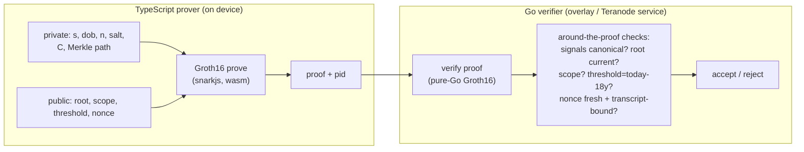

# BSV Unified Identity — Zero-Knowledge Proofs: Design & Proof-of-Concept

**Status:** v0.3 · **Scope:** the *presentation-time* proof (predicate + unlinkable pseudonym + enrolment-registry membership), with the enrolment *proof* mocked but the enrolment *registry* modelled. **Snapshot:** current as of July 2026 — library names, versions, draft numbers, and certification status all move; re-check before relying on them.
**Changes since v0.2 (breaking):** removed the scope-bound nullifier `nym` from the presentation statement — `nym = PRF(n, scope)` was recomputable by anyone who had read the passport chip, defeating the passport-reader protection the design claims (uniqueness now lives at the enrolment registry, §5, §10); moved the credential commitment `C` from public input to private witness behind a Merkle membership proof — a public `C`, identical at every presentation, was itself a cross-scope correlation handle; retired domain tag `2` permanently and added `DS_TAG` (§9); promoted transcript-derived nonces (channel binding) from advice to MUST (§8.5, §11); added canonical-range checks on public signals with a negative KAT vector (§8.5, §9); added the proof-malleability prohibition (§11) and `dob` canonicalization rules (§2.1). The Spec's `n` derivation also changed (SOD hash replaces the DG2 facial-image hash — Spec §8.4); the demo `n` value here is unaffected.
**Changes since v0.1:** added threat-model/properties table, performance estimates + measured KAT vectors, an end-to-end test script, a BSV anchoring note, and a quantum-readiness roadmap; strengthened the nonce-binding, range-check, and trusted-setup sections; corrected the permissive-stack guidance (Noir and gnark are not a turnkey prover/verifier pair — see §3, §7).

This is a companion to the standards proposal (referenced below as *Spec §N*) and its technical white paper. It exists because the zero-knowledge layer is the least familiar and highest-risk part of the design, and "Layers A–D" in Spec §13 is too abstract to build against. Here we (1) write down exactly what the presentation proof must prove, (2) give a buildable proof-of-concept with a TypeScript on-device prover and a Go server-side verifier, (3) name the concrete libraries in both languages, (4) tell the truth about what "certified" can and cannot mean today, and (5) give measured test vectors so the two language stacks can be trusted to agree.

---

## 1. What we are proving, and what we are not

Spec §13 defines four capability layers: **(A)** selective disclosure, **(B)** attribute predicates, **(C)** multi-show unlinkable presentation, **(D)** a single succinct proof of the whole statement including — for the free Tier-1 self-read — verifying the passport's ICAO 9303 passive-authentication signature chain *in-circuit*.

Layer D at enrolment is the heavy, unfamiliar part (millions of constraints to verify an RSA/ECDSA document-signer signature inside a circuit). The design deliberately **amortizes** it: prove the passport once at enrolment, register the resulting commitment in an anchored enrolment registry, and thereafter every presentation is a cheap proof over that registry. This PoC builds the cheap, everyday half — the **presentation proof** — and *mocks* the enrolment proof by fabricating a registry entry where the issuer/passport proof would go. The registry itself (a Poseidon Merkle tree of active commitments) is modelled for real, because since v0.3 the presentation proves membership in it. That isolates the predicate-plus-pseudonym-plus-membership mechanics (Layers A/B plus the pseudonym) so they can be proven out end-to-end, in the exact TS-prover / Go-verifier split a BSV deployment would use, without first solving the passport circuit.

**In scope:** prove, in zero knowledge, that the holder (a) holds a credential committing to their secret and attributes, (b) that credential is a member of the anchored enrolment registry — without revealing *which* member, (c) satisfies a predicate (age ≥ 18) without revealing the underlying attribute, and (d) derives a pseudonym stable for one relying party and unlinkable across relying parties — revealing only the pseudonym and the truth of the predicate.

**Out of scope (mocked):** how a registry entry came to exist — the issuer signature (Tier 2/3) or the in-circuit passport passive-authentication proof (Tier 1), and the registry's one-registration-per-person enforcement at enrolment time (§5, §10 specify it; §12 says how to remove the mock).

**What is deliberately absent (the v0.2 lesson):** no `n`-derived value appears anywhere in the presentation. v0.2 revealed `nym = PRF(n, scope)` as a public output so relying parties could deduplicate accounts — but `n` is recomputable by anyone who has read the passport chip and `scope` is public, so any border agency, airline, hotel, or passport thief could compute every RP's `nym` for the holder and join dedup records back to the real passport identity. Uniqueness is now enforced once, at enrolment (one active registration per person, §10), and presentations reveal only `pid` — which is keyed by the wallet-held secret `s` and *is* safe against passport readers.

---

## 2. The statement, precisely

Let `PRF` be a SNARK-friendly pseudo-random function (Poseidon over the proof field), with distinct domain-separation tags per use (registry in §9). The holder has a wallet-held **presentation secret** `s` (derived from the root secret, Spec §8.4), a **personhood nullifier** `n` (fixed at enrolment; one-way function of passport identity — document number, MRZ, SOD hash — *not secret*, Spec §8.4), and credential attributes (here, date of birth `dob`).

**Public inputs** (agreed by prover and verifier): `root` — the current root of the anchored enrolment registry (a Poseidon Merkle tree over active credential commitments, §10); `scope` — a canonical hash of the relying-party identity; `threshold` — the newest `dob` that is still ≥ 18 today, computed by the verifier (§2.1); `nonce` — the verifier's freshness challenge, derived from the session transcript (§8.5).

**Public outputs** (revealed): `pid` — the scoped pseudonym. Nothing else.

**Private witness** (never revealed): `s`, `dob`, `n`, the commitment blinding `salt`, and the Merkle path (`siblings`, `pathIndex`) locating the holder's commitment `C` in the registry. Note that `C` itself is witness data now: revealing the same `C` at every presentation — as v0.2 did — would let colluding relying parties link a holder across scopes regardless of everything else.

The circuit enforces:

- **R1 — credential opening:** `C = PRF(DS_COMMIT, s, dob, n, salt)`, computed in-circuit from the witness.
- **R2 — predicate:** `dob ≤ threshold` ⇔ age ≥ 18. Only the *truth* of this is revealed, never `dob`.
- **R3 — scoped pseudonym:** `pid = PRF(DS_PID, s, scope)`. Stable for a scope, one-way, uncorrelated across scopes, and *not* derivable from `n`.
- **R4 — registry membership:** the Merkle path authenticates `C` under the public `root`. The proof shows *a* registered credential is being presented without showing *which*.
- **R5 — freshness:** the proof is bound to `nonce` (see §8.1 for how, and why the verifier still does the real work).

Why the `s` / `n` split still matters (Spec §8.4): `pid` is keyed only by `s`, so someone who has read the passport (and can recompute `n`) cannot compute anyone's pseudonyms; `n` anchors one-registration-per-person at enrolment, so uniqueness survives across wallets and re-installs. The v0.3 rule that completes the design: **`n`-derived values never leave enrolment.** Anything derived from `n` that is revealed at presentation time — however it is scoped or hashed — is recomputable by whoever has handled the passport, and becomes a join key against every store it lands in.



### 2.1 `dob` and `threshold` canonicalization

"Days since epoch" hides real interoperability failures — two-digit MRZ years, partial birthdates, timezones, and leap days all produce cross-implementation `pid`-breaking mismatches or false age rejections if left to each implementer. Normative rules:

- **Encoding.** `dob` is the number of whole days from 1970-01-01 to the date of birth in the proleptic Gregorian calendar; no timezone applies to a calendar date. (`1990-01-01` → `7305`.)
- **MRZ century.** MRZ dates carry two-digit years. Resolve the century so the resulting birth date is the latest one not after the document's issue date; where DG11 carries a full birth date, DG11 wins.
- **Partial dates.** Some documents carry `YYMM00` or `YY0000` birthdates. Missing day or month is filled with the **latest** possible value (month `12`, last day of month) — the conservative direction: a holder with a partial date is never treated as older than they can be proven to be. Implementations MUST flag partial-date credentials in credential metadata.
- **Threshold.** The verifier computes `threshold` as today's date in UTC minus 18 years, same calendar; if the subtraction lands on a nonexistent Feb 29, use Feb 28. The predicate `dob ≤ threshold` then accepts exactly the holders whose 18th birthday is today or earlier, with the Feb-29-born attaining age on Mar 1 of non-leap years — one day later than jurisdictions that count Feb 28, i.e. one day conservative in the verifier's favour, which is the only acceptable direction for age gating.
- **Vectors.** `1990-01-01` → `7305`. `2008-07-10` → `14070`; on 2026-07-10 (UTC), `threshold = 2008-07-10 → 14070`, so a holder born `2008-07-10` passes (`14070 ≤ 14070`) and one born `2008-07-11` (`14071`) fails. On 2026-02-28, `threshold = 2008-02-28 → 13937`, so a holder born `2008-02-29` (`13938`) fails and passes from 2026-03-01 (`threshold = 2008-03-01 → 13939`).

---

## 3. Choosing a proving system for the PoC

The binding constraint is **prove in TypeScript on the device, verify in Go on the server.** That rules out anything without a real prover in one language and a verifier in the other, over a matching curve and serialization.

**Track A — general-purpose SNARK (Circom + Groth16 on BN254). Used by this PoC.** Circom is the de-facto circuit language; snarkjs is a pure-JS/wasm prover that runs on-device; and there are pure-Go verifiers that accept snarkjs proofs verbatim (§7). Groth16 gives ~128–256-byte proofs and constant-time verification. Its cost is a per-circuit trusted setup (§8.3). This track proves the *genuine* ZK predicate (`dob → age≥18` inside the circuit), the pseudonym derivation, and the registry membership directly — exactly Spec §13 Layer B plus the pseudonym, over a set-membership statement.

**Track B — anonymous credentials (BBS + per-verifier pseudonyms).** BBS signatures give selective disclosure with multi-show unlinkable presentations; the CFRG "BBS per-verifier linkability" draft adds a pseudonym constant for one prover↔verifier pair and unlinkable across verifiers — i.e. `pid` as a native primitive. This is the ETSI/ARF-catalogued direction (Spec §19.4). Limitation: predicates like age ≥ 18 are not native — the standards-track workaround is an issuer-provided `age_over_18` boolean claim, selectively disclosed (the ISO mDL / EUDI approach), rather than a range proof — and registry membership is likewise outside the base scheme. Both BBS and its pseudonym mechanism are IRTF *drafts*; implementations are early and cross-vendor interop needs care.

> **Decision log — why Groth16/Circom for the PoC.**
> - *Smallest proofs, constant-time verify.* Groth16 proofs are 3 group elements (~128–256 B) and verify in constant time regardless of circuit size — ideal for a server verifying many presentations and for bandwidth-limited wallets.
> - *Only turnkey TS-prove → Go-verify path today.* snarkjs proves in wasm on-device; iden3's pure-Go verifier consumes those proofs unchanged (§7). No other stack gives that split out of the box right now.
> - *Genuine predicate ZK.* Track A proves `age≥18` from `dob` in-circuit, demonstrating Layer B rather than sidestepping it with a pre-issued boolean.
> - *Accepted cost:* a per-circuit trusted setup (§8.3) and BN254 (not post-quantum, §12.1). Both are addressed on the production roadmap by moving to a universal-setup (PLONK) or transparent (Halo2/STARK) system.
> - *Not chosen for shipping:* Circom/snarkjs are GPL-3.0. For a shipped wallet, prefer a permissive stack (§7).

**Shipped-wallet recommendation (read §7 before choosing).** For anything distributed in a wallet binary, prioritize **permissive-licensed** tooling — Noir (MIT/Apache-2.0) on the prover side, and/or gnark (Apache-2.0). Note the correction from v0.1: **Noir and gnark are not a drop-in prover/verifier pair.** Noir's mainstream backend is Barretenberg (verified by `bb`, not by gnark); a community backend (`lambdaclass/noir_backend_using_gnark`) bridges Noir's ACIR to gnark (PLONK working, Groth16 WIP) but is experimental. So the permissive path is real but less turnkey than the GPL Circom/snarkjs → pure-Go-iden3 path used here. Build the PoC on Track A for interop; plan the shipped wallet on Noir (permissive), tracking the Noir→Go verification tooling.

---

## 4. The "certified" question — the honest answer

The requested bar was **formally certified (FIPS / Common Criteria / eIDAS)**. State it plainly: **no zero-knowledge proving library is FIPS-140-validated, Common Criteria-certified, or on any eIDAS trusted list — for any scheme, in any language.** FIPS validation covers cryptographic *primitives and modules* — SHA-2/SHA-3, ECDSA, RSA, AES, HMAC, the DRBG, and now the post-quantum signatures ML-DSA and SLH-DSA (FIPS 204/205) and ML-KEM (FIPS 203). It does not cover Groth16, PLONK, Halo2, STARKs, Bulletproofs, BBS+, or Poseidon. Common Criteria certifies *products* against protection profiles (secure elements, the EUDI wallet's secure cryptographic device); the ZK proving code is not that boundary. ETSI TR 119 476 — the reference the ARF points to — is a *survey* of selective-disclosure and ZK schemes, not a certification.

So "use a certified ZK library" is, in 2026, unsatisfiable as literally stated. The defensible architecture that gets as close as the state of the art allows:

1. **Keep the certified crypto inside the certified boundary.** Key generation, ECDSA/EdDSA signing, hashing, and randomness happen in the FIPS/CC-certified secure element (the wallet's WSCD). This is also the direct answer to the documented EU concern that early wallet pilots failed for not protecting key material in certified hardware (Spec §18.5).
2. **Treat the ZK proof as an application-layer computation *about* those certified operations, outside the certified boundary.** The circuit proves statements over commitments to values the certified module produced or signed. A proof is *publicly verifiable*: its soundness rests on the proving system and the circuit, not on trusting the prover's library or device. An attacker who replaces the prover cannot forge an accepted proof of a false statement — so the prover library need not be certified for the *verifier's* guarantee to hold.
3. **Harden the part certification would otherwise cover — circuit soundness — with audit and formal verification.** The dominant real-world ZK failure is the *under-constrained circuit*. Use static analyzers built for exactly this: `circomspect`, and the formal tools `Picus` and `Ecne`; for Noir, the `NAVe` line of ACIR formal verification. Pair with an independent audit. This is the practical substitute for "certified" until an eIDAS ZK certification regime exists — which the ARF's post-launch ZKP track is expected to move toward but has not delivered.
4. **Prefer primitives with a certification story where you have a choice.** Verification-side hashing and signature checks inside the certified module should use FIPS-validated implementations; where the roadmap needs post-quantum, ML-DSA (FIPS 204) is the certified target for the signing key, with the ZK layer proving over its outputs (§12.1).

Bottom line for the repo: this PoC uses **audited, widely-deployed** libraries and treats formal certification as a production-roadmap gap to be stated openly, not a checkbox that can be ticked today.

---

## 5. Security properties, threat model & revocation

**Threat model, in one paragraph.** The adversaries of concern are: colluding relying parties pooling what they store; a relying party colluding with the issuer; a passive network observer; a replay attacker; a thief of a device or credential; and — specific to this design — anyone who has read the holder's passport and can therefore recompute `n`. The presentation proof is built to hold against all of these *at the cryptographic layer*; it explicitly does **not** defeat network-level correlation (IP, timing, device fingerprint), which is a transport concern handled outside the proof (Spec §20.2), and it does not protect a device already compromised at proving time. One residual is accepted and named: because enrolment publishes a deterministic tag `PRF(DS_TAG, n)` (§10), a passport reader can test *whether the holder has enrolled at all* — a far smaller leak than v0.2's per-RP account join, and the price of permissionless global uniqueness (Spec §10.7).

| Property | Mechanism | Holds against |
|---|---|---|
| Cross-scope unlinkability | `pid = PRF(s, scope)`, `s` wallet-only; `C` hidden behind the membership proof (never revealed) | colluding RPs pooling `pid` and everything else they see |
| Attribute privacy | ZK; only the predicate's truth is revealed | the verifier; a network observer |
| Soundness / pseudonym unforgeability | Groth16 soundness + fully-constrained circuit | a malicious prover |
| Uniqueness (one account per scope) | one active registration per person at the enrolment registry (`tag = PRF(DS_TAG, n)`, §10) ⇒ one `s` per person ⇒ one stable `pid` per scope | Sybil behaviour within a scope; re-enrolment with a fresh wallet |
| Passport-reader ≠ pseudonym-holder | no `n`-derived value revealed at presentation; `pid` keyed by `s` only | someone who recomputed `n` (residual: can test enrolment existence, above) |
| Replay resistance | transcript-derived `nonce` binding + verifier single-use tracking (§8.5) | proof replay; relay to a different RP |
| Predicate integrity | verifier sets and checks `threshold` itself | a prover lying about age |
| **Not covered** | — | network correlation; pre-proving device compromise; within-scope linkability (by design); enrolment-existence test by chip readers (accepted residual) |

**Revocation sketch.** Two complementary mechanisms, deliberately layered because unlinkability constrains what is possible:

- *Registration-level (global) revocation* happens at the enrolment registry: revoking or evicting a registration removes its `C` from the active set, the registry root changes, and every future presentation by that credential fails the R4 membership check — global de-recognition without linking the holder's scopes. Issuer-attested tiers can layer a status list or accumulator on top (Spec §11, §13.5).
- *Per-scope (local) blocking* uses the pseudonym: because `pid` is stable for a relying party, that party keeps its own `pid` block-list and rejects listed presenters. Rate-limiting and one-account enforcement within a scope also key off `pid`.
- *The honest limit:* you **cannot** globally block a *person* across scopes by correlating their scoped values — unlinkability forbids it by construction. Global de-recognition is done at the enrolment anchor (evict the registration), never by correlating per-scope identifiers. This is the same "de-recognition, not correlation" stance as the wider design.

On BSV specifically, the registry, its root history, and per-scope `pid` block-lists are naturally overlay-indexed and anchored on-chain (§10).

**Proof bytes are not identifiers.** Groth16 proofs are re-randomizable: anyone can produce a different-looking valid proof of the same statement without the witness. Proof bytes MUST NOT be used as a uniqueness, deduplication, or anti-replay handle anywhere in the stack — not by verifiers, not by overlay indexers. Freshness comes from the verifier's single-use nonce; account identity comes from `pid`; nothing else about a presentation is stable, and nothing else may be treated as if it were.

---

## 6. Performance (estimated; KATs measured)

These are **order-of-magnitude estimates for the small presentation circuit** below (~1.5–2k R1CS constraints at the demo depth 3; a production registry depth of ~32 adds ~29 more Poseidon(2) levels, landing around ~9–12k), not measurements on your hardware — run the benchmark in §9 on the target device. They are *not* the enrolment (Layer D passport) circuit, which is millions of constraints and takes seconds to tens of seconds, one time.

| Metric | Estimate | Notes |
|---|---|---|
| R1CS constraints | ~1.5–2k (depth 3) / ~9–12k (depth 32) | Poseidon(5) + Poseidon(3) + DEPTH× Poseidon(2) + 2× Num2Bits(32) + LessEqThan |
| Proof size (Groth16, BN254) | ~128–256 B | 2×G1 + 1×G2; JSON encoding is larger; independent of depth |
| Proving — snarkjs (wasm), laptop | ~0.1–0.5 s | includes witness generation; scales with depth |
| Proving — snarkjs (wasm), phone | ~0.5–2 s | device-dependent |
| Proving — rapidsnark (native), phone | ~50–300 ms | rapidsnark is ~4–10× faster than snarkjs (§8.4) |
| Verification (Go, pairing-based) | **~1–3 ms** | 3 pairings + a small MSM; constant in depth; **not** sub-microsecond |
| Verify throughput | ~hundreds–1,000 /s/core | constant-time per proof |

A note on the "ns/µs" hope: Groth16 verification is *constant-time* but pairing-dominated, so it lands in **low single-digit milliseconds**, not nanoseconds. If you need sub-millisecond or batched verification, that is a reason to evaluate a different system (e.g. batched STARK verification), not a property Groth16-on-BN254 will give you.

**Measured cross-language anchor:** the Poseidon KAT vectors in §9 were computed in-container with `circomlibjs` and are reproduced by the Go side with `go-iden3-crypto/poseidon` (same canonical BN254 parameters). Those fixed vectors — now including the registry tag and the Merkle node chain — are what make the two stacks trustworthy against each other.

---

## 7. Libraries

Status labels: *audited* = has ≥1 public third-party security audit; *reference* = maintained but not independently audited; *draft-stage* = implements an IRTF/ETSI draft, expect churn. None are FIPS/CC/eIDAS certified (§4).

### TypeScript (on-device prover)

| Library | Role | Scheme / curve | License | Status |
|---|---|---|---|---|
| `circom` (compiler) | compile circuit → R1CS + wasm | R1CS | GPL-3.0 | de-facto standard |
| `snarkjs` | prove + verify (wasm) | Groth16 / PLONK / FFlonk, BN254 | GPL-3.0 | reference; very widely deployed |
| `circomlibjs` | witness-side Poseidon/EdDSA helpers | BN254 | GPL-3.0 | reference |
| `@mattrglobal/bbs-signatures` | BBS+ prove/verify (Track B) | BBS+, BLS12-381 | Apache-2.0 | audited; scheme is draft-stage |
| `@noir-lang/noir_js` + `bb.js` | prove (permissive alternative) | UltraHonk, BN254/grumpkin | MIT / Apache-2.0 | maturing; permissive |

### Go (server-side verifier)

| Library | Role | Scheme / curve | License | Status |
|---|---|---|---|---|
| `github.com/iden3/go-rapidsnark/verifier` | verify snarkjs proofs (pure Go) | Groth16, BN254 | Apache-2.0 / MIT | maintained; used in Polygon ID's auth stack |
| `github.com/iden3/go-circom-prover-verifier` | verify (and prove) Circom proofs, pure Go | Groth16, BN254 | GPL-3.0 | works; lighter maintenance |
| `github.com/consensys/gnark` | prove + verify (audited, heavyweight) | Groth16 / PLONK, BN254 & others | Apache-2.0 | audited; native format — bridge with `gnark-to-snarkjs` |
| `github.com/iden3/go-iden3-crypto/poseidon` | Poseidon (KAT reproduction, §9) | BN254 | Apache-2.0 / MIT | reference; matches circomlib params |
| `github.com/hyperledger/aries-framework-go` (bbs12381g2pub) | BBS+ verify (Track B) | BBS+, BLS12-381 | Apache-2.0 | draft-stage scheme; confirm current module path |

**Licensing — decisive for a shipped wallet.** Circom, snarkjs, circomlibjs, and iden3's `go-circom-prover-verifier` are **GPL-3.0**. Circuits and proofs you author are your own artifacts, but bundling GPL code into a distributed wallet binary pulls GPL obligations into that binary. If that is unwelcome — for a wallet it usually is — the permissive options are:
- **Prover:** Noir (`noir_js` + `bb.js`), MIT/Apache-2.0.
- **Verifier:** `go-rapidsnark/verifier` (Apache-2.0/MIT) for the Circom path, or `gnark` (Apache-2.0) for a gnark-native path.
- **Caveat (the v0.1 correction):** Noir's proofs are verified by Barretenberg, not by gnark, so "Noir prover + gnark verifier" is not a drop-in pair. Bridging them means the experimental `noir_backend_using_gnark` (ACIR→gnark) or wrapping `bb` from Go. A fully permissive, fully turnkey TS-prove/Go-verify path does not yet exist; the honest choice for a shipped wallet is Noir-permissive with a Barretenberg-based Go verification shim, tracked as the tooling matures.

---

## 8. Building the PoC

```
zk-poc/
  circuits/presentation.circom
  scripts/mock-enrolment.mjs        # fabricates a registry entry + demo registry
  prover-ts/prove.ts                # on-device prover (TypeScript)
  verifier-go/main.go               # server-side verifier (Go)
  test/e2e.sh                       # §9 end-to-end script
  test/kat.json                     # §9 known-answer vectors
```

### 8.1 The circuit

The PoC instantiates the registry tree at `DEPTH = 3` (8 leaves) so the §9 vectors stay printable; a production registry runs the same template at depth ~32. Phase-2 keys are depth-specific (§8.3).

```circom
pragma circom 2.1.9;

include "poseidon.circom";     // circomlib
include "comparators.circom";  // circomlib: LessEqThan
include "bitify.circom";       // circomlib: Num2Bits (range checks)

// Registry membership: authenticate `leaf` under `root` along a Merkle path.
// Node hash is untagged 2-arity Poseidon — the fixed registry convention (§9).
template MerkleInclusion(DEPTH) {
    signal input leaf;
    signal input siblings[DEPTH];
    signal input pathIndex[DEPTH];  // 0: current node is the left child; 1: right
    signal output root;

    signal cur[DEPTH + 1];
    cur[0] <== leaf;
    component h[DEPTH];
    for (var i = 0; i < DEPTH; i++) {
        pathIndex[i] * (1 - pathIndex[i]) === 0;   // booleanity — soundness, not decoration
        h[i] = Poseidon(2);
        h[i].inputs[0] <== cur[i] + pathIndex[i] * (siblings[i] - cur[i]);
        h[i].inputs[1] <== siblings[i] + pathIndex[i] * (cur[i] - siblings[i]);
        cur[i + 1] <== h[i].out;
    }
    root <== cur[DEPTH];
}

// Presentation proof (enrolment proof mocked; registry modelled).
// Reveals only: pid and the truth of (age >= 18). Nothing else — not C, and
// no n-derived value (see §1 for why both of those are now witness-side).
template Presentation(DEPTH) {
    // private witness
    signal input s;                    // presentation secret (wallet-only, from root secret)
    signal input dob;                  // date of birth, days since 1970-01-01 (§2.1)
    signal input n;                    // personhood nullifier (fixed at enrolment; not secret)
    signal input salt;                 // commitment blinding
    signal input siblings[DEPTH];      // Merkle path to the holder's registry leaf
    signal input pathIndex[DEPTH];

    // public inputs
    signal input root;      // current enrolment-registry root (anchored, §10)
    signal input scope;     // canonical hash of the relying-party identity
    signal input threshold; // newest dob still >= 18 today (verifier-set, §2.1)
    signal input nonce;     // verifier freshness challenge (transcript-derived, §8.5)

    // public outputs
    signal output pid;      // scoped pseudonym

    var DS_COMMIT = 0;      // domain-tag registry: §9. Tag 2 (v0.2 nym) is retired.
    var DS_PID    = 1;

    // --- Range checks (see §11: this is a soundness requirement, not decoration) ---
    // LessEqThan(k) is only sound when BOTH inputs are known to be in [0, 2^k).
    // Field elements are ~254 bits; without these bounds a prover could choose a
    // `dob` that, reduced mod p, appears small and slips past the age check.
    // Num2Bits(32) forces dob and threshold into [0, 2^32) before comparison.
    component rDob = Num2Bits(32); rDob.in <== dob;
    component rThr = Num2Bits(32); rThr.in <== threshold;

    // R1: credential opening  C == Poseidon(DS_COMMIT, s, dob, n, salt)
    component commit = Poseidon(5);
    commit.inputs[0] <== DS_COMMIT;
    commit.inputs[1] <== s;
    commit.inputs[2] <== dob;
    commit.inputs[3] <== n;
    commit.inputs[4] <== salt;

    // R2: predicate  age >= 18  <=>  dob <= threshold
    component le = LessEqThan(32);
    le.in[0] <== dob;
    le.in[1] <== threshold;
    le.out === 1;

    // R3: pid = Poseidon(DS_PID, s, scope)
    component pidH = Poseidon(3);
    pidH.inputs[0] <== DS_PID;
    pidH.inputs[1] <== s;
    pidH.inputs[2] <== scope;
    pid <== pidH.out;

    // R4: registry membership — C is authenticated under the public root and
    // never revealed. Which leaf is presented stays hidden inside the witness.
    component inc = MerkleInclusion(DEPTH);
    inc.leaf <== commit.out;
    for (var i = 0; i < DEPTH; i++) {
        inc.siblings[i] <== siblings[i];
        inc.pathIndex[i] <== pathIndex[i];
    }
    root === inc.root;

    // R5: nonce binding (see §11). In Groth16 every PUBLIC input is already bound
    // to the proof by the verification equation, so a proof made for one `nonce`
    // fails verification if presented with another. The constraint below simply
    // forces the compiler to retain the signal in the R1CS; it is defensive, not
    // the source of freshness. The real anti-replay guarantee is the verifier
    // issuing a single-use, time-boxed, transcript-derived nonce and rejecting
    // reuse (§8.5, §11).
    signal nonceBound;
    nonceBound <== nonce * nonce;
}

component main {public [root, scope, threshold, nonce]} = Presentation(3);
```

### 8.2 Mock enrolment (stands in for the issuer / passport proof — not the registry)

```js
// scripts/mock-enrolment.mjs   —  run:  node scripts/mock-enrolment.mjs > input.json
import { buildPoseidon } from "circomlibjs";

const poseidon = await buildPoseidon();
const F = poseidon.F;
const H = (arr) => F.toObject(poseidon(arr.map(BigInt)));

const DS_COMMIT = 0n, DS_TAG = 3n;
const s    = 123456789n;   // wallet secret (demo)
const n    = 987654321n;   // personhood nullifier (demo; production: Spec §8.4 derivation)
const salt = 424242n;      // blinding
const dob  = 7305n;        // days since 1970-01-01, i.e. 1990-01-01 (§2.1)

// threshold = today (UTC) minus 18 years, as days since epoch (§2.1)
const now = new Date();
const t = new Date(Date.UTC(now.getUTCFullYear() - 18, now.getUTCMonth(), now.getUTCDate()));
const threshold = BigInt(Math.floor(t.getTime() / 86400000));

const C   = H([DS_COMMIT, s, dob, n, salt]);
const tag = H([DS_TAG, n]);   // enrolment-registry uniqueness key (§10) — anchored, never presented

// Demo registry: depth-3 Poseidon Merkle tree, C at index 0, empty leaves = 0.
const DEPTH = 3;
let cur = C, siblings = [], pathIndex = [];
let empty = 0n;
for (let i = 0; i < DEPTH; i++) {
  siblings.push(empty); pathIndex.push(0n);          // C sits leftmost
  cur = H([cur, empty]);
  empty = H([empty, empty]);
}
const root = cur;

process.stdout.write(JSON.stringify({
  s: s+"", dob: dob+"", n: n+"", salt: salt+"",
  siblings: siblings.map(String), pathIndex: pathIndex.map(String),
  root: root+"", scope: "1122334455", threshold: threshold+"", nonce: "0"
}, null, 2));
// In production the registry entry {C, tag, proof-ref} is NOT fabricated: it is
// created by a publicly verifiable Layer-D enrolment proof (Tier 1) or an issuer
// attestation (Tier 2/3), and the overlay enforces one active entry per tag (§10).
```

### 8.3 Compile + trusted setup (Groth16)

```bash
npm i circomlib snarkjs circomlibjs     # circom compiler is a separate Rust binary

circom circuits/presentation.circom --r1cs --wasm --sym \
  -l node_modules/circomlib/circuits -o build

# Phase 1 (universal). For the PoC a local single contribution is fine.
snarkjs powersoftau new bn128 14 build/pot14_0.ptau -v
snarkjs powersoftau contribute build/pot14_0.ptau build/pot14_1.ptau --name="poc" -v
snarkjs powersoftau prepare phase2 build/pot14_1.ptau build/pot14_final.ptau -v

# Phase 2 (circuit-specific).
snarkjs groth16 setup build/presentation.r1cs build/pot14_final.ptau build/pp_0.zkey
snarkjs zkey contribute build/pp_0.zkey build/pp_final.zkey --name="poc2" -v
snarkjs zkey export verificationkey build/pp_final.zkey build/verification_key.json
```

> **Trusted-setup warning — do not ship the PoC keys.** A single-contribution Groth16 setup is fine for *testing* but gives **no** security in production: whoever ran the ceremony holds toxic waste that lets them forge proofs. A real deployment needs one of:
> - a **multi-party ceremony** (many independent contributors; security holds as long as *at least one* discarded their secret) — the standard for shipped Groth16 systems; or
> - a **universal setup** (PLONK: one reusable SRS across circuits, still ceremony-based but not per-circuit); or
> - a **transparent system** with *no* setup and *no* toxic waste (Halo2, STARKs) — which also doubles as the quantum-readiness path (§12.1).
>
> Phase-2 keys are circuit-specific: any change to the circuit — including the registry `DEPTH` — invalidates them and requires a fresh ceremony. Never reuse PoC `.zkey` files in production.

### 8.4 TypeScript prover (on device)

```ts
// prover-ts/prove.ts
import * as snarkjs from "snarkjs";
import fs from "node:fs";

const input = JSON.parse(fs.readFileSync("input.json", "utf8")); // §8.2 output + session scope/threshold/nonce

const { proof, publicSignals } = await snarkjs.groth16.fullProve(
  input,
  "build/presentation_js/presentation.wasm",
  "build/pp_final.zkey"
);

const vkey = JSON.parse(fs.readFileSync("build/verification_key.json", "utf8"));
console.log("self-verify:", await snarkjs.groth16.verify(vkey, publicSignals, proof));

// publicSignals order = [ pid, root, scope, threshold, nonce ]  (outputs first)
fs.writeFileSync("proof.json", JSON.stringify(proof));
fs.writeFileSync("public.json", JSON.stringify(publicSignals));
```

> **Faster native proving on mobile — rapidsnark.** `snarkjs` proving is wasm and portable but slow; **rapidsnark** (iden3, C++/assembly) is ~4–10× faster and is the usual choice for on-device proving at scale. Use the platform wrappers — `iden3/android-rapidsnark` (Kotlin) and the iOS build of `iden3/rapidsnark` — on the prover side; on a Go server the CGO wrapper `iden3/go-rapidsnark/prover` proves, while its `verifier` subpackage verifies in pure Go. For this small presentation circuit snarkjs is already sub-second; rapidsnark matters much more for the heavy enrolment circuit (§12).

### 8.5 Go verifier (server)

```go
// verifier-go/main.go
package main

import (
	"encoding/json"
	"fmt"
	"math/big"
	"os"

	"github.com/iden3/go-rapidsnark/types"
	"github.com/iden3/go-rapidsnark/verifier"
)

// BN254 scalar-field modulus r: every public signal MUST be a canonical
// representative in [0, r). snarkjs emits decimal strings; a verifier that
// accepts values >= r accepts ALIASED inputs (x and x+r verify identically)
// — see the negative KAT vector in §9.
var rMod, _ = new(big.Int).SetString(
	"21888242871839275222246405745257275088548364400416034343698204186575808495617", 10)

func canonical(sigs []string) bool {
	for _, s := range sigs {
		v, ok := new(big.Int).SetString(s, 10)
		if !ok || v.Sign() < 0 || v.Cmp(rMod) >= 0 {
			return false
		}
	}
	return true
}

func main() {
	vkey, _ := os.ReadFile("build/verification_key.json")
	proofRaw, _ := os.ReadFile("proof.json") // snarkjs proof: pi_a, pi_b, pi_c, protocol
	pubRaw, _ := os.ReadFile("public.json")
	var pub []string
	_ = json.Unmarshal(pubRaw, &pub)

	// 0) Canonical-range check — BEFORE anything else touches the signals.
	if len(pub) != 5 || !canonical(pub) {
		fmt.Println("REJECT: non-canonical or malformed public signals")
		return
	}

	var pd types.ProofData
	_ = json.Unmarshal(proofRaw, &pd) // struct tags map snarkjs field names
	zkp := types.ZKProof{Proof: &pd, PubSignals: pub}

	// 1) Cryptographic check.
	if err := verifier.VerifyGroth16(zkp, vkey); err != nil {
		fmt.Println("REJECT: invalid proof:", err)
		return
	}

	// 2) Around-the-proof checks — the proof is necessary, NOT sufficient.
	//    pub = [pid, root, scope, threshold, nonce]
	pid, root, scope, threshold, nonce := pub[0], pub[1], pub[2], pub[3], pub[4]
	_ = pid // account identity for this scope; blocked/rate-limited RP-locally (§5)
	if !currentRegistryRoot(root) || scope != expectedScope() ||
		threshold != todayMinus18y() || nonce != issuedNonce() {
		fmt.Println("REJECT: proof valid but context checks failed")
		return
	}
	fmt.Println("ACCEPT")
}
```

The `nonce` the verifier issues MUST be single-use, time-boxed, and **transcript-derived**: `nonce = H(scope ‖ verifier identity key ‖ holder's per-RP presentation key ‖ verifier random challenge)`, computed over the mutually authenticated session (BRC-103 identity keys, or TLS channel binding on the OpenID path). This binds the proof to the transport identity presenting it — without it, a malicious app that obtains a victim's valid proof can relay it over its own authenticated session (Spec §14.4, now a MUST). `currentRegistryRoot` accepts the overlay's current anchored root (or a recent checkpoint within the verifier's staleness policy, §10).

> Pin the `go-rapidsnark` version and check `types.ProofData` field names / `VerifyGroth16` signature against that release. `iden3/go-circom-prover-verifier` is a pure-Go alternative with no `go-rapidsnark` dependency; `gnark` is the audited heavyweight if you convert formats with `gnark-to-snarkjs`.

### 8.6 What success looks like

A valid run yields a ~128–256-byte proof, sub-second proving (this small circuit), ~1–3 ms verification in Go, and: an identical `pid` across repeated presentations to the same `scope`, a *different* `pid` when `scope` changes, and rejection when `dob > threshold`, when `nonce` is stale or transcript-mismatched, when any public signal is ≥ the field modulus, or when the Merkle path does not authenticate against the registry root the verifier holds.

---

## 9. End-to-end test & known-answer vectors

Cross-language trust rests on both stacks computing the *same field elements*. The vectors below were **computed in-container with `circomlibjs`** (BN254 Poseidon) for the fixed inputs shown, and are reproduced by the Go side with `go-iden3-crypto/poseidon` (identical canonical parameters). Commit them as `test/kat.json` and assert against them in CI.

**Domain-separation tag registry (normative — Spec Appendix C).** Tags are single field constants; the registry, not ad-hoc choice, assigns them. Once a tag is retired it is never reused for a different purpose.

| Tag | Value | Use |
|---|---|---|
| `DS_COMMIT` | `0` | credential commitment (R1) |
| `DS_PID` | `1` | scoped pseudonym (R3) |
| — | `2` | **retired** (v0.2 `nym`; never reuse) |
| `DS_TAG` | `3` | enrolment-registry uniqueness tag (§10) |
| (node hash) | — | registry Merkle nodes use untagged 2-arity Poseidon, by convention |

**KAT inputs**

| field | value |
|---|---|
| `s` | `123456789` |
| `dob` | `7305` |
| `n` | `987654321` |
| `salt` | `424242` |
| `scope` | `1122334455` |
| registry | depth 3; leaf `C` at index 0; empty leaf = `0` |

**KAT outputs (BN254 scalar field, decimal)**

| output | value |
|---|---|
| `C` = Poseidon(0, s, dob, n, salt) | `11961317046022870684612121917755977040778124309654297708450313435006677619971` |
| `pid` = Poseidon(1, s, scope) | `13113349617659562893553735040003403084041236485955215136524577327427403897823` |
| `tag` = Poseidon(3, n) | `20635803422720675195732022269746658780711331026842343184051583585497124793033` |
| `z1` = Poseidon(0, 0) | `14744269619966411208579211824598458697587494354926760081771325075741142829156` |
| `z2` = Poseidon(z1, z1) | `7423237065226347324353380772367382631490014989348495481811164164159255474657` |
| `n00` = Poseidon(C, 0) | `1635497621709885835389108769299234005943059557715155240324459068139120982152` |
| `n10` = Poseidon(n00, z1) | `14379370280644895444814618787803605322921366399996957694461305639794049716096` |
| `root` = Poseidon(n10, z2) | `4205519698481322585977244152006164588667706120548530395567929012107584053966` |

(`C` and `pid` are unchanged from v0.2 — the commitment structure and pseudonym derivation did not move; the v0.2 `nym` vector is deleted with its statement line, and its tag is retired above.)

**Negative vector (canonicality).** `pid′ = pid + r = 35001592489498838115800140785260678172589600886371249480222781514003212393440`, where `r` is the BN254 scalar modulus in §8.5. A conforming verifier MUST reject any presentation whose public signals include `pid′` (or any value ≥ `r`) **before** pairing checks; a verifier that reduces instead of rejecting treats `pid′` and `pid` as the same account — an aliasing bug the conformance suite must catch.

**Node assertion (proves the TS witness helpers match the KAT):**

```js
// test/assert-kat.mjs
import { buildPoseidon } from "circomlibjs";
import fs from "node:fs";
const kat = JSON.parse(fs.readFileSync("test/kat.json", "utf8"));
const p = await buildPoseidon(); const F = p.F;
const H = (a) => F.toObject(p(a.map(BigInt))).toString();
const i = kat.inputs;
const C = H([0, i.s, i.dob, i.n, i.salt]);
const z1 = H([0, 0]), z2 = H([z1, z1]);
const n00 = H([C, 0]), n10 = H([n00, z1]);
const got = {
  C, pid: H([1, i.s, i.scope]), tag: H([3, i.n]),
  z1, z2, n00, n10, root: H([n10, z2]),
};
for (const k of Object.keys(got)) if (got[k] !== kat.outputs[k]) { console.error("KAT MISMATCH", k); process.exit(1); }
console.log("KAT OK (TS)");
```

**Go assertion (proves the Go verifier's Poseidon matches the same KAT):**

```go
// test/assert_kat.go
package main
import ("encoding/json"; "fmt"; "math/big"; "os"; "github.com/iden3/go-iden3-crypto/poseidon")
func main() {
	raw, _ := os.ReadFile("test/kat.json")
	var kat struct{ Inputs, Outputs map[string]string }
	_ = json.Unmarshal(raw, &kat)
	bi := func(s string) *big.Int { n, _ := new(big.Int).SetString(s, 10); return n }
	h := func(xs ...*big.Int) *big.Int { v, _ := poseidon.Hash(xs); return v }
	in := kat.Inputs
	zero := big.NewInt(0)
	C := h(bi("0"), bi(in["s"]), bi(in["dob"]), bi(in["n"]), bi(in["salt"]))
	z1 := h(zero, zero); z2 := h(z1, z1)
	n00 := h(C, zero); n10 := h(n00, z1)
	got := map[string]*big.Int{
		"C": C, "pid": h(bi("1"), bi(in["s"]), bi(in["scope"])), "tag": h(bi("3"), bi(in["n"])),
		"z1": z1, "z2": z2, "n00": n00, "n10": n10, "root": h(n10, z2),
	}
	for k, v := range got {
		if v.String() != kat.Outputs[k] { fmt.Println("KAT MISMATCH", k); os.Exit(1) }
	}
	fmt.Println("KAT OK (Go)")
}
```

**End-to-end driver:**

```bash
#!/usr/bin/env bash
# test/e2e.sh — full loop; fails nonzero on any mismatch
set -euo pipefail
cd "$(dirname "$0")/.."

node test/assert-kat.mjs                       # TS Poseidon matches KAT (incl. tag + Merkle chain)
( cd test && go run assert_kat.go )            # Go Poseidon matches KAT (same field elements)

node scripts/mock-enrolment.mjs > input.json   # fabricate registry entry + demo registry
npx tsx prover-ts/prove.ts                     # produce proof.json / public.json (self-verifies in TS)
( cd verifier-go && go run main.go )           # Go verifier: expect ACCEPT (and REJECT on the §9 negative vector)

echo "E2E OK"
```

If the two KAT assertions pass, the TypeScript prover and the Go verifier are computing over identical field elements — the precondition for the Go side to ever accept a TS-generated proof. If they diverge, the cause is almost always a Poseidon parameter/arity mismatch (§11).

---

## 10. The enrolment registry on BSV (Teranode)

Since v0.3 the registry is not an optional anchoring nicety — it is where uniqueness is enforced and what the R4 membership proof is checked against. The design stays consistent with Spec §7.6 (overlay/Teranode resolution) and §20.4 (only blinded or one-way data on-chain), and — because Tier 1 has no issuer — enrolment is **publicly verifiable**, not attested by a trusted enrolment service:

- **Register.** At enrolment the wallet publishes a registration record: the blinded commitment `C`, the uniqueness tag `tag = PRF(DS_TAG, n)`, and the Layer-D enrolment proof (or, for size, its hash plus a retrieval pointer into the overlay) — in a transaction data output (`OP_FALSE OP_RETURN`) or token/overlay record. *Anyone* can verify the enrolment proof against the published DSC/CSCA trust root (§12): no issuer, and no trusted enrolment service quietly reintroduced. Never PII; `n` itself never appears — only `tag`, which is one-way.
- **Enforce uniqueness.** The overlay admits at most **one active registration per `tag`** — first valid registration wins. Because `tag` is deterministic from the passport, re-enrolling with a fresh wallet or fresh `s` collides on the same `tag` and is rejected; this is what makes `pid` one-account-per-scope (§5). Contested registrations (stolen or pre-read passports — Spec §12) are resolved by **accountable eviction**: a Tier-2/3 proofing event over the same document evicts a Tier-1 registration and installs the accountable holder's `C`; Tier 1 alone cannot adjudicate identity theft and does not pretend to.
- **Maintain the root.** The overlay maintains the Poseidon Merkle tree over active `C`s (insertions at registration, removals at revocation/eviction) and periodically anchors the current `root` on-chain. Verifiers accept the anchored current root or a recent checkpoint within their staleness policy; a stale-root window trades revocation latency against wallet witness-refresh traffic.
- **Resolve.** An overlay service (BRC-22 topic / BRC-24 lookup) serves: current root + SPV proof of its anchoring, registration records by `tag` (for enrolment-time collision checks), and Merkle paths to wallets. Nothing here trusts a single global indexer.
- **Verify with SPV.** A verifier checks the root's anchoring transaction via Merkle proof into a block (Teranode / overlay supplies it) — a cheap, SPV-checkable answer to "is this the real, current registry?"

**Correlation surfaces, stated plainly.** Two are accepted and must be documented wherever this registry is deployed. (1) *Enrolment-existence test:* `tag` is deterministically recomputable by anyone holding the passport's chip data, so a chip reader can test whether a document has enrolled — the bounded residual named in §5; note that after Spec §8.4's v0.3 change the derivation of `n` includes the SOD hash, so computing `tag` requires having *read the chip*, not merely photographed the photo page. (2) *Registration timing:* the registration transaction's timing and funding are a linkage surface between the holder's wallet and their enrolment; mitigate with batched anchoring windows, randomized submission delay, and third-party transaction broadcast. (3) *Path retrieval:* asking the overlay for your Merkle path identifies your leaf; wallets SHOULD fetch paths via anonymous transport, request ranges/frontiers rather than single paths, or maintain the path incrementally from published tree updates.

---

## 11. Pitfalls specific to this PoC

- **Under-constrained circuits are the #1 ZK vulnerability.** Every output must be fully determined by constraints. Run `circomspect`, and `Picus`/`Ecne` for formal under-constrained detection, before trusting any circuit. The v0.3 additions have their own instances: the `pathIndex` booleanity constraints in `MerkleInclusion` are soundness-critical (an unconstrained index lets a prover fabricate paths), as are the `Num2Bits(32)` guards below.
- **Range-check every comparator input.** `LessEqThan(k)` is sound only for inputs in `[0, 2^k)`. Omit the `Num2Bits(32)` guards on `dob`/`threshold` and a prover can pick a field element that wraps mod `p` to look ≤ `threshold` while encoding an out-of-range value — silently defeating the age check. The guards are a soundness requirement, not decoration; size `k` to the real domain (day counts fit well under 2³²).
- **Reject non-canonical public signals.** snarkjs public signals are decimal strings; a Go verifier that parses then silently reduces mod `r` accepts aliased values (`x` and `x + r` verify identically). Check every signal is in `[0, r)` **before** verification (§8.5) and keep the §9 negative vector in CI. This is a known ecosystem foot-gun, not a theoretical one.
- **Nonce binding is necessary but not sufficient — and MUST be transcript-derived.** Groth16 binds every *public* input to the proof cryptographically, so a proof made for one `nonce` will not verify against another — that is the actual freshness mechanism, and the `nonce * nonce` line only guarantees the compiler keeps the signal. The substantive anti-replay work is verifier-side: issue a **single-use, time-boxed** nonce derived from a transcript that pins `scope`, the verifier's identity key, and the holder's per-RP presentation key (§8.5; Spec §14.4). A bare random nonce prevents replay to the *same* verifier but not relay by a malicious app over its own authenticated session.
- **Proofs are malleable; never index them.** Groth16 proofs are re-randomizable — the same witness yields unlimited distinct valid proof encodings. Any overlay or verifier that uses proof bytes as a dedup key, rate-limit key, or identifier is broken by design (§5). `pid` is the only stable presentation-side identifier, and only within its scope.
- **Verifier around-the-proof checks are load-bearing.** A valid proof only says "some witness satisfies the circuit." The verifier must still pin `root` (current/checkpoint, anchored, §10), `scope`, `threshold` (computed by the verifier, never taken from the prover), and `nonce`. Trusting the prover's `threshold` lets anyone claim to be 18; trusting the prover's `root` lets anyone claim membership of a registry of one.
- **Scope canonicalization.** `pid` is stable only if both sides derive `scope` identically (same canonical RP identifier, same hash). Specify it exactly and test it.
- **Witness freshness.** Every registry update changes `root` and invalidates cached Merkle paths. Wallets must refresh paths (see §10's retrieval-privacy note) or presentations fail against the verifier's current root — an availability failure, not a security one, but a support-ticket generator if unhandled.
- **Cross-language serialization.** BN254, decimal-string public signals, and proof-point encoding must match between snarkjs and the Go verifier. The §9 KATs lock the hash layer; add one known proof/vkey/public triple as a fixture to lock the proof layer too.
- **Poseidon parameters must match** across the witness generator (`circomlibjs`), the circuit (`circomlib`), and the Go side (`go-iden3-crypto`). A parameter/arity mismatch fails as a wrong hash — the most common cause of a KAT divergence in §9.
- **Linkable within scope, by design.** `pid` is deliberately constant per scope (that is what enables one-account-per-person). "Unlinkable" means *across* scopes. If a use case needs unlinkability even within a scope, do not reveal a stable `pid` — reveal only a fresh per-session value and rely on the R4 membership proof alone.

---

## 12. Graduating to production

Removing the mock is the whole game, and it maps straight onto Spec §13:

- **Tier 2/3 (issuer-attested):** replace the fabricated registry entry with an issuer-created one — an issuer-side commitment the issuer signs, an issuer signature verified in-circuit, or a ZK-native credential signature (BBS+/PS) so no reusable signature becomes a correlation handle (the "binding problem", Spec §13.4). The registry uniqueness rule is the same; the issuer's accountability is what upgrades eviction disputes (§10).
- **Tier 1 (free self-read):** at enrolment, verify the ICAO 9303 passive-authentication chain (the document-signer's RSA/ECDSA signature over the data groups) *inside* a circuit, deriving `n` and `tag` from chip data and publishing the registration record of §10 — proof included, so the registration is publicly verifiable without an issuer. This is Layer D and the expensive step — amortized once, so the per-presentation proof stays exactly the cheap circuit built here. Production passport-ZK systems (ZKPassport, Self, OpenPassport, Rarimo) show it is shippable on phones; heterogeneous national signature algorithms are the real coverage cost.
- **Trust-anchor governance (new, and unavoidable):** in-circuit passive authentication needs the accepted DSC/CSCA certificate set as a public input — in practice a Merkle root over accepted certificates. Someone must curate that root: ICAO PKD access is paid-membership, CSCA master-list coverage is incomplete, and certificates rotate. Specify the curator (a multi-party overlay function, not a single vendor), the update cadence, the on-chain anchoring of root history, and the verifier behaviour across root rotations — this is the certificate-corpus twin of the registry-root question in §10 and it gates real-world coverage as much as circuit engineering does.
- **AA/CA coverage (Spec §12):** active/chip authentication is a MUST wherever Tier-1 uniqueness is relied on, because passive authentication cannot detect cloned chips — but a large share of circulating passports (notably US passports) implement neither. A deployment MUST publish a per-document-type capability matrix and its policy when AA/CA is absent: register at a reduced assurance mark (no uniqueness guarantee), or decline Tier-1 uniqueness for that document class. Silently downgrading is the one behaviour the spec forbids.
- **Multi-show unlinkability of disclosed attributes:** if you disclose attributes (not just predicates) and need them unlinkable across presentations, move that path to Track B (BBS) or a fresh per-presentation SNARK.

The presentation circuit in §8.1 is intended to survive this transition unchanged: enrolment changes how a registry entry comes to exist, not what the presentation proves.

### 12.1 Quantum-readiness roadmap

Treat the current stack as **interim on the post-quantum axis**:

- **What is weak:** BN254 is a pairing curve whose security rests on (elliptic-curve) discrete-log and pairing hardness — broken by a cryptographically-relevant quantum computer (CRQC). Groth16-on-BN254 and BBS+/BBS# (also pairing-based) are therefore **not** post-quantum. What is comparatively robust: Poseidon and other hashes degrade only mildly under Grover (mitigated by larger output), so hash-based commitments — including the registry tree — carry over.
- **Urgency is moderate, not nil.** A proof is less "harvest-now-decrypt-later" sensitive than ciphertext — verifying a proof today leaks no secret a future CRQC could exploit. What does matter is (a) *forgeability* of proofs and (b) the *binding* of long-lived commitments under a future CRQC, so migration must complete before CRQCs arrive, not after.
- **The path:**
  1. **Keys/control → ML-DSA (FIPS 204):** migrate identity and control keys via DID key rotation as the whitepaper's PQ note already anticipates; ML-DSA is the certified target.
  2. **Proof system → transparent + hash-based:** move the proving system to STARKs (hash-based, transparent, PQ-plausible) — which also eliminates the trusted setup (§8.3). Halo2 removes the trusted setup sooner but is still discrete-log-based, so it is a transparency win, not a PQ one.
  3. **Double hash outputs** where a commitment must remain binding across the CRQC horizon.
- **Watch item:** post-quantum SNARKs with succinct proofs and cheap verification are still maturing; track NIST PQC and the lattice/hash-SNARK literature, and keep the proof system pluggable (Spec §13.1) so the curve/scheme can be swapped without touching the identifier and control layers.

---

## 13. References

- Spec §§7, 8, 10, 11, 13, 19, 20 — this repo's standards proposal (statement, tiers, ZK toolbox, anchoring, security).
- Circom / snarkjs — `https://docs.circom.io`, `https://github.com/iden3/snarkjs`.
- Pure-Go Circom verifiers — `https://github.com/iden3/go-rapidsnark`, `https://github.com/iden3/go-circom-prover-verifier`.
- gnark — `https://github.com/consensys/gnark`; format bridge `https://github.com/mysteryon88/gnark-to-snarkjs`; Noir→gnark experiment `https://github.com/lambdaclass/noir_backend_using_gnark`.
- rapidsnark — `https://github.com/iden3/rapidsnark`, `https://github.com/iden3/android-rapidsnark`.
- Poseidon in Go — `https://github.com/iden3/go-iden3-crypto`.
- Circuit analysis — `circomspect` (`https://github.com/trailofbits/circomspect`), `Picus`, `Ecne`; Noir ACIR formal verification (`NAVe`).
- BBS — `draft-irtf-cfrg-bbs-signatures`; pseudonyms `draft-irtf-cfrg-bbs-per-verifier-linkability`; `@mattrglobal/bbs-signatures`.
- Certification landscape — NIST FIPS 203/204/205 (ML-KEM / ML-DSA / SLH-DSA); ETSI TR 119 476 (survey of selective-disclosure & ZKP schemes); the EUDI ARF ZKP topic (deployment expected post-launch, Spec §19.4).

*No library named here is FIPS/Common-Criteria/eIDAS certified; see §4 for how the design reconciles that with a certified secure-element boundary. KAT vectors in §9 were computed with circomlibjs; all performance figures in §6 are estimates — measure on target hardware with §9's driver.*
